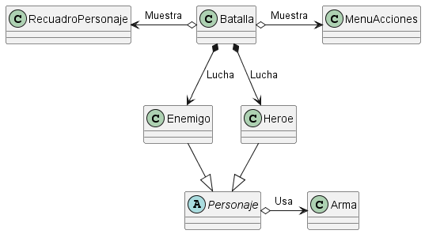
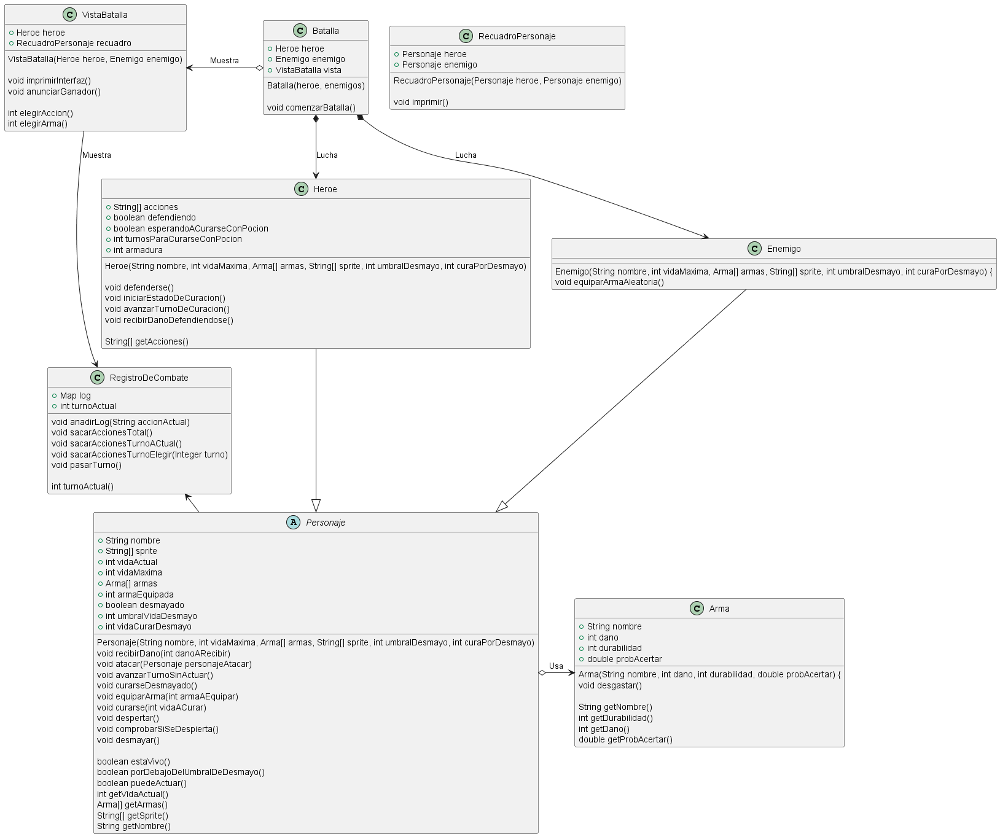
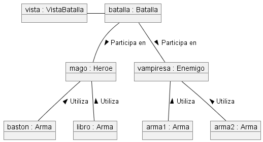
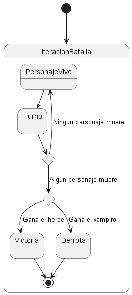
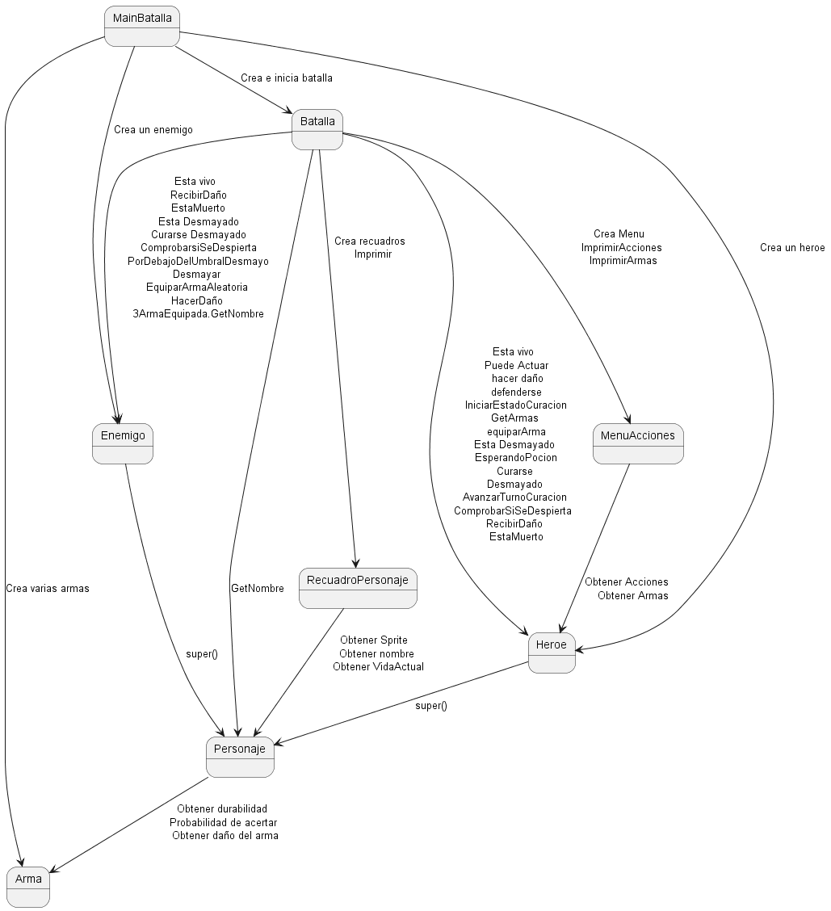

# Proyecto de batalla

<h5> Requisitos </h5>

  
 Idea inicial de la batalla 
 

  [Link](../docs/proyectos/pyBatalla.md)

<h5> Modelo de dominio </h5>

  
Diagrama de clases (Simple)

  
|Diagrama de clases
|:-:
|
|[Link](MDominio/ClasesSimple.puml)

  
Diagrama de clases (Completo)

  
|Diagrama de clases
|:-:
|
|[Link](MDominio/ClasesCompleto.puml)

  
Diagrama de objetos

  
|Diagrama de objetos
|:-:
|
|[Link](MDominio/Objetos.puml)

  
Diagrama de estados

  
|Diagrama de estados
|:-:
|
|[Link](MDominio/Estados.puml)

  
Diagrama de colaboración

  
|Diagrama de colaboración
|:-:
|
|[Link](MDominio/Colaboracion.puml)

<h5>Métricas</h5>

  
Clase MainBatalla

| Métricas  | Valor |
|---|---|
| Número de líneas | 12   |
| Número de métodos           | 1      |
| Número de atributos          | 0     |

  
Clase Batalla

### Métricas de la clase Batalla
| Métrica | Valor |
| --- | --- |
| Número de líneas | 77 |
| Número de métodos | 4 |
| Número de atributos | 3 |

### Métricas métodos clase Batalla

|Método| Parámetros | Líneas | Sentencias anidadas| Complejidad ciclomática|
|----|-----| ---- | -----| ---- |
|Batalla() | 2 | 3 |  0 |   1  |
|comenzarBatalla() | 0 | 22 | 2 | 8  |
|turnoHeroe() |  0 | 8 |  0 |   4  |
|turnoEnemigo() | 0 | 2 |  0 |   1  |

  
Clase VistaBatalla

### Métricas de la clase VistaBatalla

| Métricas                | Valor |
|------------------------|-------|
| Número de líneas        | 90   |
| Número de métodos       | 9     |
| Número de atributos     | 6     |

### Métricas métodos clase VistaBatalla

|Método| Parámetros | Líneas | Sentencias anidadas| Complejidad ciclomática|
|----|-----| ---- | -----| ---- |
|VistaBatalla() | 2 | 3 |  0 |   1  |
|imprimirInterfaz() | 0 | 1 | 0 | 1  |
|anuciarGanador() | 1 | 1 | 0 | 1  |
|elegirAcción() | 0 | 13 | 0 | 5  |
|elegirArma() | 0 | 2 | 0 | 1  |
|esperarInteraccion() | 0 | 2 | 0 | 1  |
|scanElegir() | 1 | 12 | 0 | 3  |
|mostrarAcciones() | 0 | 3 | 0 | 1  |
|mostrarArmas() | 0 | 3 | 0 | 1 |

  

  
Clase Personaje

### Métricas de la clase Personaje

| Métricas  | Valor |
|---|---|
| Número de líneas | 112      |
| Número de métodos           | 17       |
| Número de atributos          | 9        |

### Métricas métodos clase Personaje

|Método| Parámetros | Líneas | Sentencias anidadas| Complejidad ciclomática|
|----|-----| ---- | -----| ---- |
|Personaje() | 6 | 7 |  0 |   1  |
|recibirDaño() | 1 | 6 | 0 | 2  |
|atacar() | 1 | 11 | 0 | 4 |
|puedeActuar() | 0 | 1 | 0 | 1  |
|avanzarTurnoSinActuar() | 0 | 1 | 0 | 1  |
|curarseDesmayado() | 0 | 2 | 0 | 1  |
|curarse() | 1 | 1 | 0 | 3  |
|despertar() | 0 | 2 | 0 | 1  |
|comprobarSiSeDespierta() | 0 | 3 | 0 | 3  |
|estaVivo() | 0 | 1 | 0 | 1  |
|desmayar() | 0 | 2 | 0 | 1  |
|getVidaActual() | 0 | 1 | 0 | 1  |
|equiparArma() | 0 | 1 | 0 | 1  |
|getArmas() | 0 | 1 | 0 | 1  |
|getSprite() | 0 | 1 | 0 | 1  |
|getNombre() | 0 | 1 | 0 | 1  |

  

  
Clase Heroe

### Métricas de la clase Heroe

| Métricas  | Valor |
|---|---|
| Número de líneas | 92      |
| Número de métodos           | 9    |
| Número de atributos          | 5      |

### Métricas métodos clase Heroe

|Método| Parámetros | Líneas | Sentencias anidadas| Complejidad ciclomática|
|----|-----| ---- | -----| ---- |
|Heroe() | 6 | 1 |  0 |   1  |
|defenderse() | 0 | 5 | 0 | 2  |
|iniciarEstadoDeCuración() | 0 | 3 | 0 | 1  |
|avanzarTurnoDeCuración() | 0 | 6 | 0 | 2  |
|puedeActuar() | 0 | 1 | 0 | 1  |
|recibirDaño() | 1 | 11 | 0 | 4  |
|avanzarTurnoSinActuar() | 0 | 8 | 0 | 5  |
|recibirDañoDefendiendose() | 1 | 6 | 0 | 3  |
|getAcciones() | 0 | 1 | 0 | 1  |

  
Clase Enemigo

### Métricas de la clase Enemigo

| Métricas  | Valor |
|---|---|
| Número de líneas | 21    |
| Número de métodos           | 2       |
| Número de atributos          | 0        |

### Métricas métodos clase Enemigo

|Método| Parámetros | Líneas | Sentencias anidadas| Complejidad ciclomática|
|----|-----| ---- | -----| ---- |
|Enemigo() | 6 | 1 |  0 |   1  |
|equiparArmaAleatoria() | 0 | 2 | 0 | 1  |

  
Clase RecuadroPersonaje

  ### Métricas de la clase RecuadroPersonaje

| Métricas  | Valor |
|---|---|
| Número de líneas | 93   |
| Número de métodos           | 4      |
| Número de atributos          | 2      |

### Métricas métodos clase RecuadroPersonaje

|Método| Parámetros | Líneas | Sentencias anidadas| Complejidad ciclomática|
|----|-----| ---- | -----| ---- |
|RecuadroPersonaje() | 2 | 2 |  0 |   1  |
|unirSprites() | 0 | 8 | 0 | 2  |
|llenarHuecos() | 2 | 8 | 0 | 3  |
|imprimir() | 0 | 19 | 0 | 2  |

  
Clase Arma

### Métricas de la clase Arma
| Métricas  | Valor |
|---|---|
| Número de líneas | 37   |
| Número de métodos           | 6    |
| Número de atributos          | 4     |

### Métricas métodos clase Arma

|Método| Parámetros | Líneas | Sentencias anidadas| Complejidad ciclomática|
|----|-----| ---- | -----| ---- |
|Arma() | 4 | 4 |  0 |   1  |
|getNombre() | 0 | 1 | 0 | 1  |
|getDurabilidad() | 0 | 1 | 0 | 1  |
|getDaño() | 0 | 1 | 0 | 1  |
|getProbAcertar() | 0 | 1 | 0 | 1  |
|desgastar() | 0 | 1 | 0 | 1  |

  
Clase RegistroDeCombate

### Métricas de la clase RegistroDeCombate

| Métricas  | Valor |
|---|---|
| Número de líneas | 45   |
| Número de métodos           | 6      |
| Número de atributos          | 2      |

### Métricas métodos clase Arma

|Método| Parámetros | Líneas | Sentencias anidadas| Complejidad ciclomática|
|----|-----| ---- | -----| ---- |
|anadirLog() | 0 | 7 | 0 | 3  |
|sacarAccionesTotal() | 0 | 3 | 0 | 2  |
|sacarAccionesTurnoActual() | 0 | 3 | 0 | 2  |
|pasarTurno() | 0 | 1 | 0 | 1  |
|turnoActual() | 0 | 1 | 0 | 1  |

  
Clase CreadorPersonajes

  ### Métricas de la clase CreadorPersonajes

| Métricas  | Valor |
|---|---|
| Número de líneas | 70   |
| Número de métodos           | 2      |
| Número de atributos          | 0      |

### Métricas métodos clase CreadorPersonaje

|Método| Parámetros | Líneas | Sentencias anidadas| Complejidad ciclomática|
|----|-----| ---- | -----| ---- |
|Enemigo() | 0 | 22 | 0 | 1  |
|Heroe() | 0 | 22 | 0 | 1  |

<h5> Futuro de proyecto </h5>

  
 Consideraciones tenidas para la escalabilidad 

  <ul>
    <li> El héroe y los enemigos se pueden pasar como parámetros a la batalla, de esta forma puedes tener distintos personajes, con distintas acciones, vida...
    <li> Las armas no son estándar sino que se pueden también crear y atribuir a los personajes de la batalla
    <li> ....
  <ul>

  
 Posibles mejoras futuras 

  <ul>
    <li> Se podría crear clase Pocion para poder tener distintos tipos de pociones
  <ul>

[To do list](../Grupo1/ToDo/ToDo.md)
