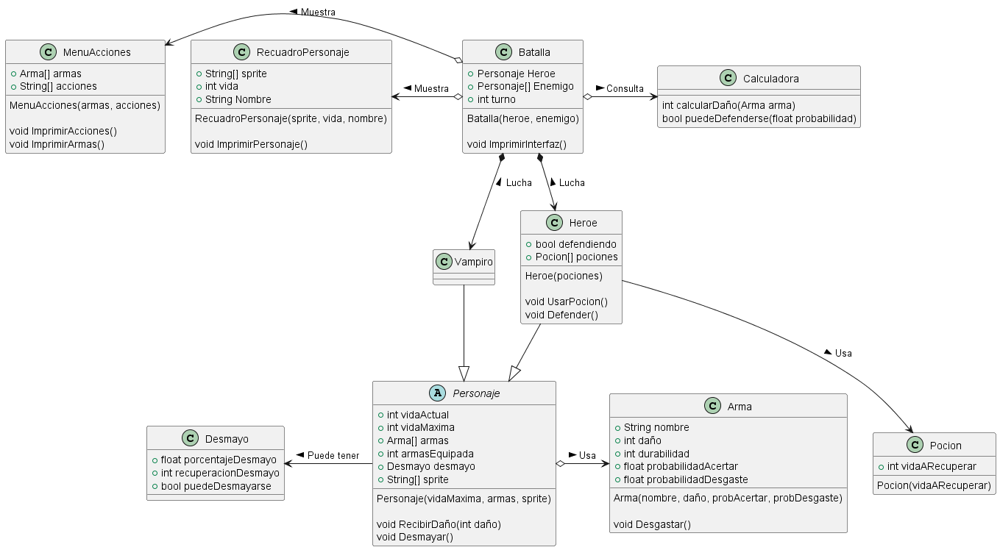

# Proyecto de batalla

[Idea de proyecto](https://github.com/DaniFdezC/IdSw2--Grupo1/blob/main/docs/proyectos/pyBatalla.md)

  
Diagrama de clases

  
|Diagrama de clases
|:-:
|
|[Link](MDominio/Clases.puml)

  
Diagrama de objetos

  
|Diagrama de objetos
|:-:
|
|[Link](MDominio/Objetos.puml)

  
Diagrama de estados

  
|Diagrama de estados
|:-:
|
|[Link](MDominio/Estados.puml)

