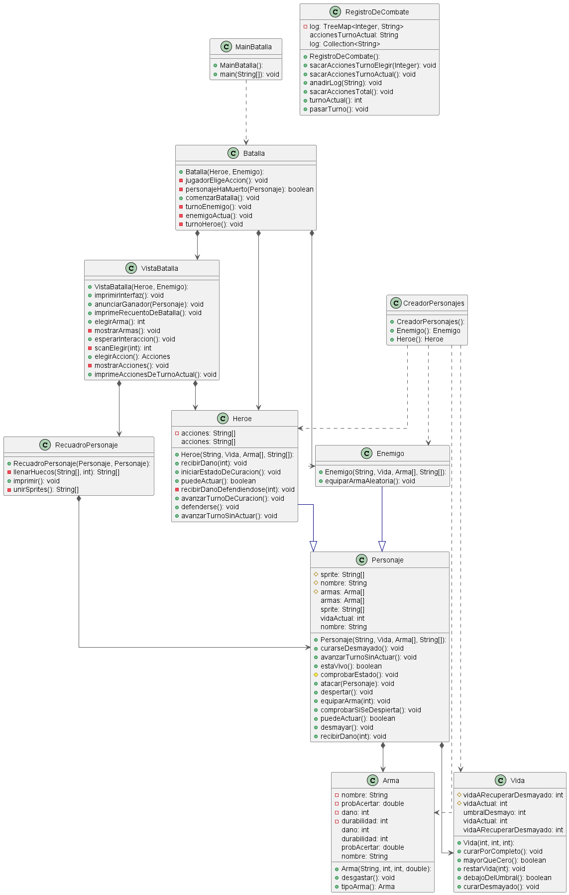

# Proyecto de batalla

<h5> Requisitos </h5>

  
 Idea inicial de la batalla 
 

  [Link](../docs/proyectos/pyBatalla.md)

<h5>V0</h5>

  
Modelo del Dominio

  |Diagrama de clases
|:-:
|
|[Link](/Grupo1/V0/MDominio/Clases.puml)

  
Codigo

  [Link](/Grupo1/V0/Codigo/Grupo1Batalla/src)

<h5>V1</h5>

  
Modelo del Dominio

  |Diagrama de clases
|:-:
|
|[Link](/Grupo1/V1/MDominio/ClasesCompleto.puml)

  
Codigo

  [Link](/Grupo1/V1/Codigo/Grupo1Batalla/src)

<h5>V2</h5>

  
Modelo del Dominio

  |Diagrama de clases
|:-:
|
|[Link](/Grupo1/V2/MDominio/Clases.puml)

  
Codigo

  [Link](/Grupo1/V2/Codigo/Grupo1Batalla/src)

<h5>Métricas</h5>

  
Clase MainBatalla

### Métricas de la clase MainBatalla

| Métricas  | Valor |
|---|---|
| Número de líneas | 8   |
| Número de métodos           | 1      |
| Número de atributos          | 0     |

### Métricas métodos clase MainBatalla

|Método| Parámetros | Líneas | Sentencias anidadas| Complejidad ciclomática|
|----|-----| ---- | -----| ---- |
|main() | 1 | 3 |  0 |   1  |

  
Clase Batalla

### Métricas de la clase Batalla
| Métrica | Valor |
| --- | --- |
| Número de líneas | 51 |
| Número de métodos | 7 |
| Número de atributos | 3 |

### Métricas métodos clase Batalla

|Método| Parámetros | Líneas | Sentencias anidadas| Complejidad ciclomática|
|----|-----| ---- | -----| ---- |
|Batalla() | 2 | 3 |  0 |   1  |
|comenzarBatalla() | 0 | 15 | 2 | 5 |
|turnoHeroe() |  0 | 5 |  0 |   2  |
|turnoEnemigo() | 0 | 4 |  0 |   2  |
|personajeJaMuerto() | 1 | 1 |  0 |   1  |
|jugadorEligeAccion() | 0 | 8 |  0 |   4  |
|enemigoActua() | 0 | 2 |  0 |   1  |

  
Clase VistaBatalla

### Métricas de la clase VistaBatalla

| Métricas                | Valor |
|------------------------|-------|
| Número de líneas        | 60   |
| Número de métodos       | 11     |
| Número de atributos     | 6     |

### Métricas métodos clase VistaBatalla

|Método| Parámetros | Líneas | Sentencias anidadas| Complejidad ciclomática|
|----|-----| ---- | -----| ---- |
|VistaBatalla() | 2 | 3 |  0 |   1  |
|imprimirInterfaz() | 0 | 1 | 0 | 1  |
|anuciarGanador() | 1 | 1 | 0 | 1  |
|elegirAcción() | 0 | 10 | 0 | 5  |
|elegirArma() | 0 | 2 | 0 | 1  |
|esperarInteraccion() | 0 | 2 | 0 | 1  |
|scanElegir() | 1 | 7 | 0 | 3  |
|mostrarAcciones() | 0 | 4 | 0 | 2  |
|mostrarArmas() | 0 | 3 | 0 | 2 |
|imprimirAccionesDeTurnoActual() | 0 | 1 | 0 | 1 |
|imprimeRecuentoDeBatalla() | 0 | 3 | 0 | 2 |

  

  
Clase Personaje

### Métricas de la clase Personaje

| Métricas  | Valor |
|---|---|
| Número de líneas | 62      |
| Número de métodos           | 16       |
| Número de atributos          | 6        |

### Métricas métodos clase Personaje

|Método| Parámetros | Líneas | Sentencias anidadas| Complejidad ciclomática|
|----|-----| ---- | -----| ---- |
|Personaje() | 6 | 4 |  0 |   1  |
|recibirDaño() | 1 | 3 | 0 | 1  |
|atacar() | 1 | 10 | 0 | 3 |
|puedeActuar() | 0 | 1 | 0 | 1  |
|avanzarTurnoSinActuar() | 0 | 1 | 0 | 1  |
|curarseDesmayado() | 0 | 5 | 0 | 2  |
|comprobarSiSeDespierta() | 0 | 2 | 0 | 2  |
|despertar() | 0 | 2 | 0 | 1  |
|estaVivo() | 0 | 1 | 0 | 1  |
|desmayar() | 0 | 2 | 0 | 1  |
|getVidaActual() | 0 | 1 | 0 | 1  |
|equiparArma() | 0 | 1 | 0 | 1  |
|getArmas() | 0 | 1 | 0 | 1  |
|getSprite() | 0 | 1 | 0 | 1  |
|getNombre() | 0 | 1 | 0 | 1  |

  

  
Clase Heroe

### Métricas de la clase Heroe

| Métricas  | Valor |
|---|---|
| Número de líneas | 56      |
| Número de métodos           | 9    |
| Número de atributos          | 5      |

### Métricas métodos clase Heroe

|Método| Parámetros | Líneas | Sentencias anidadas| Complejidad ciclomática|
|----|-----| ---- | -----| ---- |
|Heroe() | 4 | 1 |  0 |   1  |
|defenderse() | 0 | 4 | 0 | 2  |
|iniciarEstadoDeCuración() | 0 | 3 | 0 | 1  |
|avanzarTurnoDeCuración() | 0 | 7 | 0 | 3  |
|puedeActuar() | 0 | 1 | 0 | 1  |
|recibirDaño() | 1 | 8 | 0 | 2  |
|avanzarTurnoSinActuar() | 0 | 7 | 0 | 5  |
|recibirDañoDefendiendose() | 1 | 6 | 0 | 2  |
|getAcciones() | 0 | 1 | 0 | 1  |

  
Clase Enemigo

### Métricas de la clase Enemigo

| Métricas  | Valor |
|---|---|
| Número de líneas | 9    |
| Número de métodos           | 2       |
| Número de atributos          | 0        |

### Métricas métodos clase Enemigo

|Método| Parámetros | Líneas | Sentencias anidadas| Complejidad ciclomática|
|----|-----| ---- | -----| ---- |
|Enemigo() | 4 | 1 |  0 |   1  |
|equiparArmaAleatoria() | 0 | 2 | 0 | 1  |

  
Clase RecuadroPersonaje

  ### Métricas de la clase RecuadroPersonaje

| Métricas  | Valor |
|---|---|
| Número de líneas | 58   |
| Número de métodos           | 7     |
| Número de atributos          | 2      |

### Métricas métodos clase RecuadroPersonaje

|Método| Parámetros | Líneas | Sentencias anidadas| Complejidad ciclomática|
|----|-----| ---- | -----| ---- |
|RecuadroPersonaje() | 2 | 2 |  0 |   1  |
|unirSprites() | 0 | 7 | 0 | 2  |
|llenarHuecos() | 2 | 7 | 0 | 3  |
|imprimir() | 0 | 4 | 0 | 2  |
|prepararRecuadro() | 0 | 14 | 0 | 1  |
|calcularEspacioNombres() | 1 | 1 | 0 | 1  |
|calcularEspacioVidas() | 3 | 1 | 0 | 1  |

  
Clase Arma

### Métricas de la clase Arma
| Métricas  | Valor |
|---|---|
| Número de líneas | 21   |
| Número de métodos           | 6    |
| Número de atributos          | 4     |

### Métricas métodos clase Arma

|Método| Parámetros | Líneas | Sentencias anidadas| Complejidad ciclomática|
|----|-----| ---- | -----| ---- |
|Arma() | 4 | 4 |  0 |   1  |
|getNombre() | 0 | 1 | 0 | 1  |
|getDurabilidad() | 0 | 1 | 0 | 1  |
|getDaño() | 0 | 1 | 0 | 1  |
|getProbAcertar() | 0 | 1 | 0 | 1  |
|desgastar() | 0 | 1 | 0 | 1  |

  
Clase Vida

### Métricas de la clase Vida
| Métricas  | Valor |
|---|---|
| Número de líneas | 27   |
| Número de métodos           | 8   |
| Número de atributos          | 4     |

### Métricas métodos clase Vida

|Método| Parámetros | Líneas | Sentencias anidadas| Complejidad ciclomática|
|----|-----| ---- | -----| ---- |
|Vida() | 3 | 4 |  0 |   1  |
|restarVida() | 1 | 1 |  0 |   1  |
|curarDesmayado() | 0 | 1 |  0 |   1  |
|curarPorCompleto() | 0 | 1 |  0 |   1  |
|getUmbralDesmayo() | 0 | 1 |  0 |   1  |
|getVidaARecuperarDesmayado() | 0 | 1 |  0 |   1  |
|getVidaActual() | 0 | 1 |  0 |   1  |
|mayorQueCero() | 0 | 1 |  0 |   1  |
|debajoDelUmbral() | 0 | 1 |  0 |   1  |

  
Clase RegistroDeCombate

### Métricas de la clase RegistroDeCombate

| Métricas  | Valor |
|---|---|
| Número de líneas | 20   |
| Número de métodos           | 5      |
| Número de atributos          | 2      |

### Métricas métodos clase Arma

|Método| Parámetros | Líneas | Sentencias anidadas| Complejidad ciclomática|
|----|-----| ---- | -----| ---- |
|anadirLog() | 1 | 6 | 0 | 2  |
|pasarTurno() | 0 | 1 | 0 | 1  |
|turnoActual() | 0 | 1 | 0 | 1  |
|getLog() | 0 | 1 | 0 | 1  |
|getAccionesTurnoActual() | 0 | 1 | 0 | 1  |

  
Clase CreadorPersonajes

  ### Métricas de la clase CreadorPersonajes

| Métricas  | Valor |
|---|---|
| Número de líneas | 50   |
| Número de métodos           | 2      |
| Número de atributos          | 0      |

### Métricas métodos clase CreadorPersonaje

|Método| Parámetros | Líneas | Sentencias anidadas| Complejidad ciclomática|
|----|-----| ---- | -----| ---- |
|Enemigo() | 0 | 22 | 0 | 1  |
|Heroe() | 0 | 22 | 0 | 1  |

