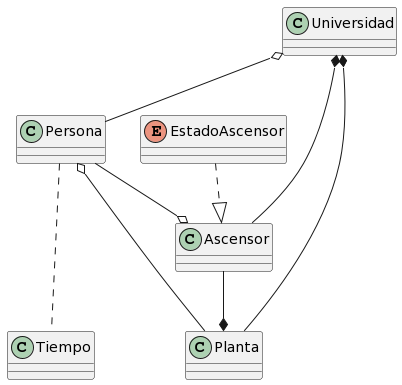
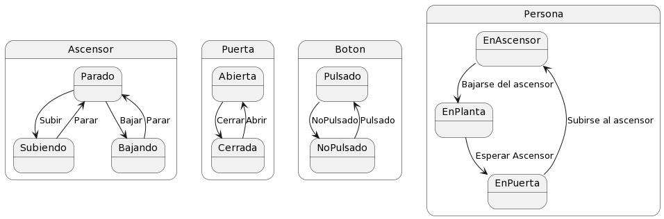

# Modelo Del Dominio

## Glosario
|                      | Descripción                                                                                                                                                 |
| -------------------- | ----------------------------------------------------------------------------------------------------------------------------------------------------------- |
| Persona              |                                                                                                                                          Individuo que puede estar en una planta de la universidad y en un ascensor.
| Tiempo               |                                                                                                                                          Variable que influye en el funcionamiento del ascensor.
| Planta               |                                                                                                                                          Niveles del edificio de la universidad donde se pueden encontrar personas y ascensores.
| Ascensor             |                                                                                                                                          Aparato que transporta a las personas entre diferentes plantas de la universidad.
| Universidad          |                                                                                                                                          Institución académica que cuenta con plantas, ascensores y personas.
| Puerta               |                                                                                                                                          Entrada o salida de un espacio que pertenece a un ascensor.
| Boton                |                                                                                                                                          Elemento que pertenece a un ascensor o a una puerta y se utiliza para activar alguna acción en ellos.

## Diagramas

  
Diagrama de clases

  
|         Diagrama de clases         
| :-: 
| 
| [Código](modeloDelDominio.puml) 

  
Diagrama de estados

    

  

| Estado                | Descripción                                                        |
| ----------------------| ------------------------------------------------------------------ |
| Ascensor Parado       |  El ascensor donde no se esta moviendo.                            |
| Ascensor Subiendo     |  EL ascensor donde se esta moviendo hacia una planta superior.     |
| Ascensor Bajando      |  El ascensor donde se esta moviendo havia una planta inferior.     |                                      
| Puerta Abierta        |  La puerta permite el paso de las personas.                        |
| Puerta Cerrada        |  La puerta impide el paso de las personas.                         |
| Boton Pulsado         |  El boton esta siendo presionado.                                  |
| Boton NoPulsado       |  El boton no esta siendo presionado.                               | 
| Persona EnAscensor    |  La persona se encuentra dentro del ascensor.                      |
| Persona EnPlanta      |  La persona se encuentra en una planta de la universidad.          |
| Persona EnPuerta      |  La persona se encuentra en una planta esperando el ascensor.      |

  
| Diagrama de estados
| :-: 
| 
| [Código](diagramaDeEstados.puml) 

