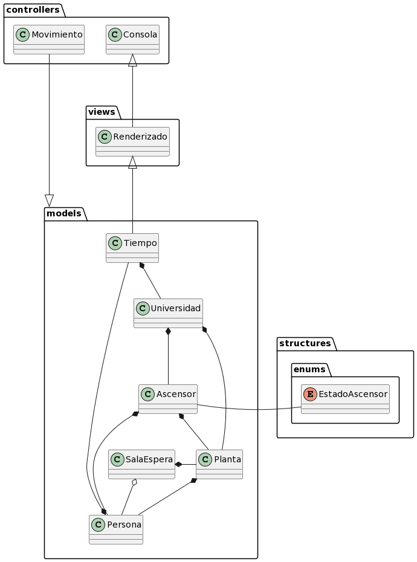

# Modelo Del Dominio

## Glosario
|                      | Descripción                                                                                                                                                 |
| -------------------- | ----------------------------------------------------------------------------------------------------------------------------------------------------------- |
| Persona              | Individuo que puede estar en una planta de la universidad o en un ascensor.                                                                                 |
| Tiempo               | Intervalo en el que las personas están en una planta o el ascensor está en movimiento.                                                                      |
| Planta               | Niveles del edificio de la universidad donde se pueden encontrar personas y ascensores.                                                                     |
| Ascensor             | Equipo que transporta a las personas entre las diferentes plantas de la universidad.                                                                        |
| Universidad          | Institución académica que cuenta con plantas, ascensores y personas.                                                                                        |
| Puerta               | Entrada o salida de un espacio que pertenece a un ascensor.                                                                                                 |
| Boton                | Elemento que pertenece a un ascensor o a una puerta y se utiliza para activar alguna acción en ellos.                                                       |

## Diagramas

  
Diagrama de clases

  
|         Diagrama de clases         
| :-: 
| 
| [Código](modeloDelDominio.puml) 

  
Diagrama de estados

    

  

| Estado                             | Descripción                                                                                |
| ---------------------------------- | ------------------------------------------------------------------------------------------ |
|                                    |                                                                                            |

  
| Diagrama de estados
| :-: 
| 
| [Código](diagramaDeEstados.puml) 

