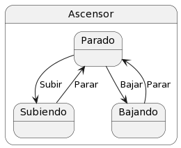

# Modelo Del Dominio

## Glosario
|                      | Descripción                                                                                                                                                 |
| -------------------- | ----------------------------------------------------------------------------------------------------------------------------------------------------------- |
| Persona              |                                                                                                                                                             |
| Tiempo               |                                                                                                                                                             |
| Planta               |                                                                                                                                                             |
| Ascensor             |                                                                                                                                                             |
| Universidad          |                                                                                                                                                             |
| Puerta               |                                                                                                                                                             |
| Boton                |                                                                                                                                                             |

## Diagramas

  
Diagrama de clases

  
|         Diagrama de clases         
| :-: 
| 
| [Código](modeloDelDominio.puml) 

  
Diagrama de estados

    

  

| Estado                             | Descripción                                                                                |
| ---------------------------------- | ------------------------------------------------------------------------------------------ |
|                                    |                                                                                            |

  
| Diagrama de estados
| :-: 
| 
| [Código](diagramaDeEstados.puml) 

