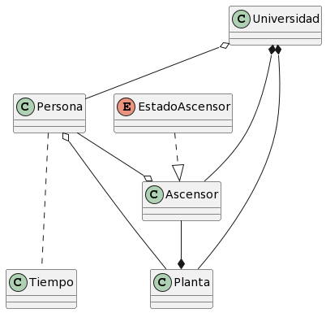
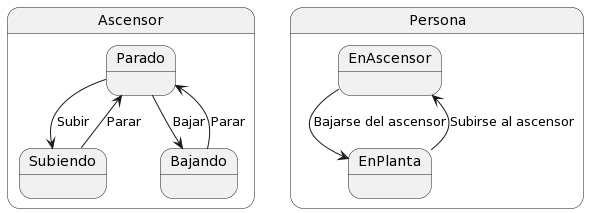
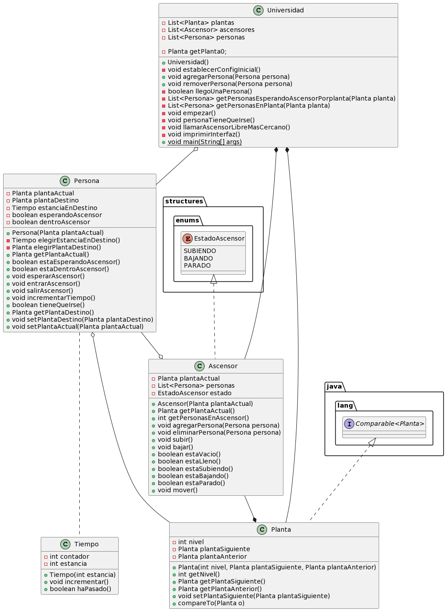

# Modelo Del Dominio

## Glosario

| Clase               | Descripción                                                                              |
| ------------------- | -----------------------------------------------------------------------------------------|
| Persona             |  Individuo que puede estar en una planta de la universidad o en un ascensor.             |
| Tiempo              |  Intervalo en el que las personas están en una planta                                    |
| Planta              |  Niveles del edificio de la universidad donde se pueden encontrar personas y ascensores. |                                      
| Ascensor            |  Equipo que transporta a las personas entre diferentes plantas de la universidad.        |
| Universidad         |  Institución académica que cuenta con plantas, ascensores y personas.                    |

## Diagramas

  
Modelo del dominio

  
|         Modelo del dominio         
| :-: 
| 
| [Código](modeloDelDominio.puml) 

  
Diagrama de estados

    

  

| Estado                | Descripción                                                        |
| --------------------- | ------------------------------------------------------------------ |
| Ascensor Parado       |  El ascensor donde no se esta moviendo.                            |
| Ascensor Subiendo     |  EL ascensor donde se esta moviendo hacia una planta superior.     |
| Ascensor Bajando      |  El ascensor donde se esta moviendo hacia una planta inferior.     |                                      
| Persona EnAscensor    |  La persona se encuentra dentro del ascensor.                      |
| Persona EnPlanta      |  La persona se encuentra en una planta de la universidad.          |

  
| Diagrama de estados
| :-: 
| 
| [Código](diagramaDeEstados.puml) 

  
Diagrama de clases

  
| Diagrama de clases
| :-: 
| 
| [Código](diagramaDeClases.puml) 

